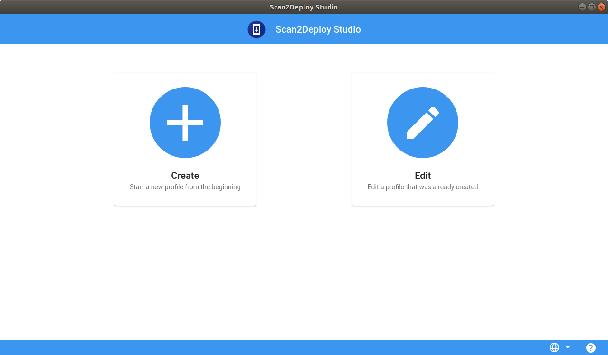
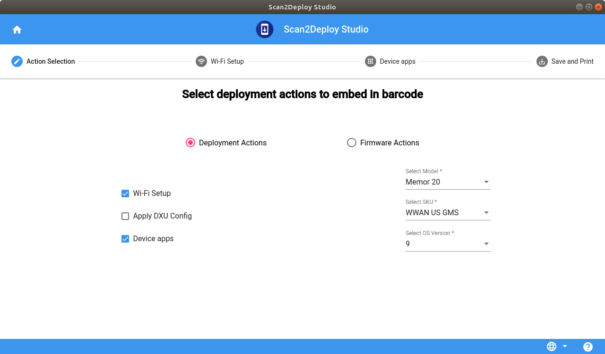
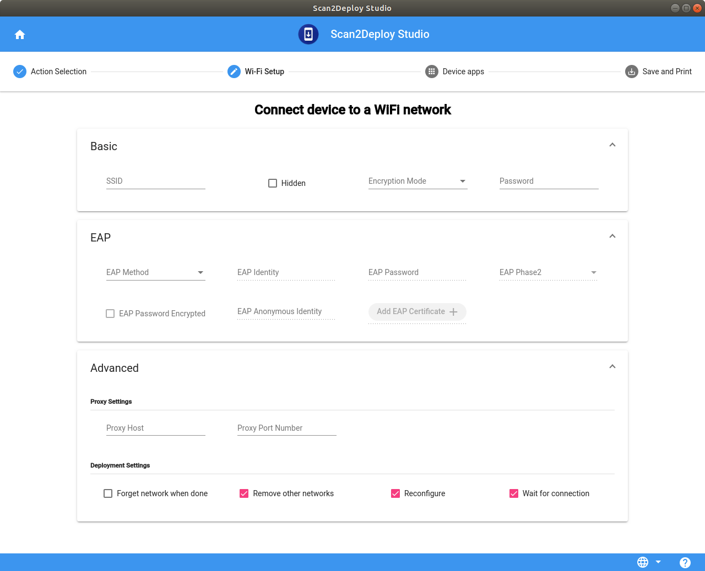
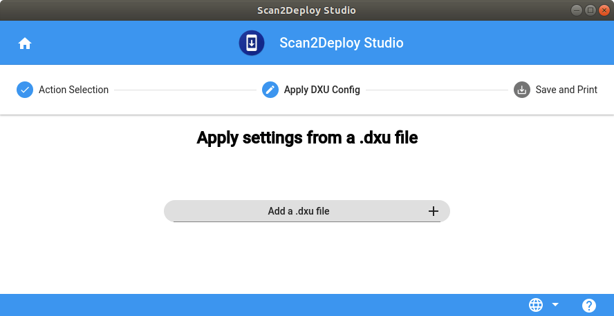
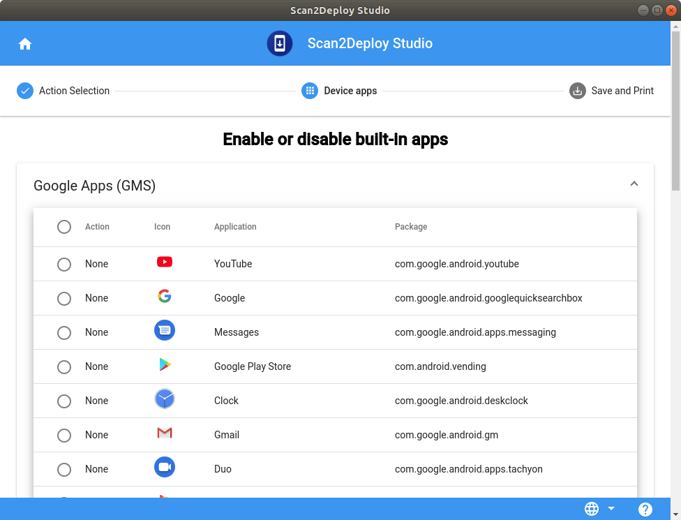
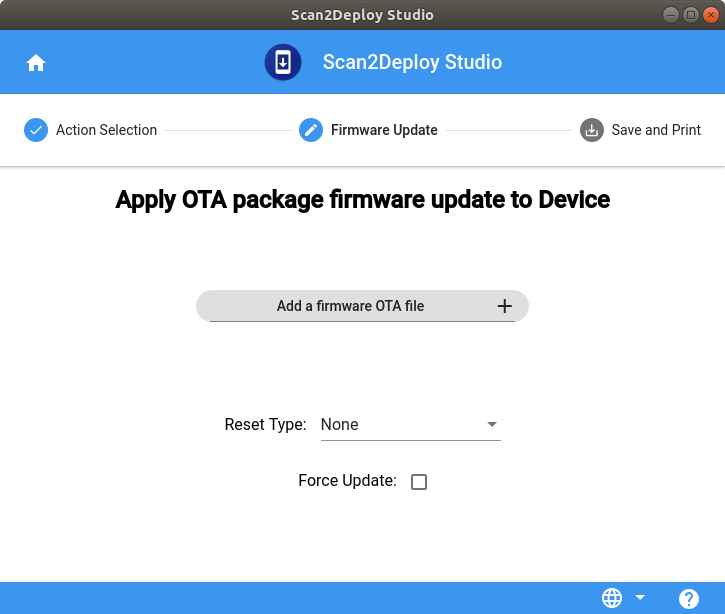
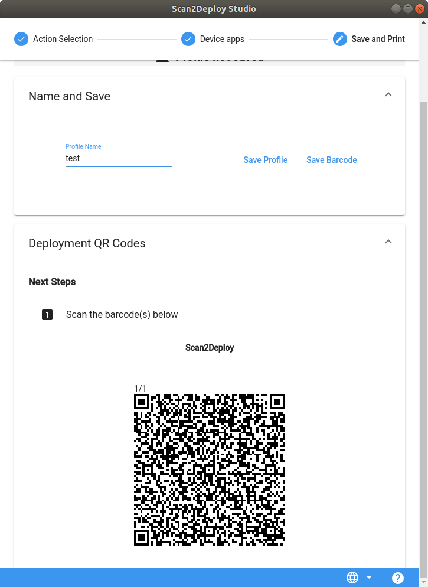

# Scan2Deploy Studio

- [Overview](#overview)
- [Compatibility](#compatibility)
- [Installation](#installation)
- [Pages](#pages)
  - [Main Menu](#main-menu)
  - [Action Selection Page](#action-selection-page)
  - [Wi-Fi page](#wi-fi-page)
  - [Apply DXU Config Page](#apply-dxu-config-page)  
  - [Device Apps Page](#device-apps-page)
  - [Firmware Update Page](#firmware-update-page)
  - [Save and Print Page](#save-and-print-page)
- [User Guide](#user-guide)
  - [Create New Deployment Profile](#create-new-deployment-profile)
  - [Create New Firmware Update Profile](#create-new-firmware-update-profile)
  - [Edit The Existing  Profile](#edit-the-existing--profile)

## Overview

Scan2Deploy Studio can be used to stage Datalogic Mobile Computers running Android 8 and above. It is installable on 64-bit Windows 7/8/10 PCs. Downloads are available in the [Releases](Releases/) section.

## Compatibility

* Scan2Deploy Studio requires [Scan2Deploy Android](https://github.com/datalogic/scan2deploy-android) version [1.11](https://github.com/datalogic/scan2deploy-android/releases/tag/v1.11) or higher running on the Android device.  All Datalogic devices running Android 9 and above should already have this version. For Android 8 devices, this version can be installed directly from the "Hi There!" setup screen as [described here](https://github.com/datalogic/scan2deploy-android#version-111).

## Installation

* Copy the installer file to any convenient location on your PC.
* Launch the installer.
* If User Access Control (UAC) is enabled on your computer, authorize the installer to run. (UAC is enabled by default on all supported Windows operating systems, but it can be disabled by default. If you do not see this prompt, UAC may have been disabled.)
* Follow on-screen prompts to finish installing.

## Pages

### Main Menu

Choose one of the following options from the main menu.

#### Create

To create a new Scan2Deploy Profile. The  output will be a tar file and Pdf file. The tar file contains deployment packages and json file. Pdf contains the deployment barcodes for ScanDeploy.  Scan2Deploy Studio allows user to create either `Deployment Profile`  or `Firmware Update Profile`.

* Deployment Profile: To configure Wi-Fi, apply DXU file and enable/disable apps on the device.

* Firmware Update Profile: To perform firmware update and configure Wi-Fi

#### Edit

To edit the existing Scan2Deploy profile (.tar file).  

### Action Selection Page

This page allows to user to add or remove various actions to the current profile, which fall under 2 categories, `Deployment Actions` and `Firmware Actions`, represented by two different radio boxes.

* By default, `Deployment Actions` radio box is selected with `Wi-Fi` action already selected.

#### Deployment Actions

* `Wi-Fi`: To configure Wifi on the device

* `Apply DXU Config`: To apply the settings exported from DXU Desktop in .dxu file to the device.

* `Device Apps`: To enable/disable GMS, Non-GMS, System apps on the selected device type.

#### Firmware Update Actions

* `Wi-Fi`: To configure Wifi on the device

* `Firmware Update`: To update firmware on the selected device type

If user selects any action which is device specific e.g. `Firmware Update` or `Device Apps`, the user will be presented with device selection dropdowns which consists of the following fields:

* Model (e.g. Memor 20, Memor 10 etc.)
* SKU (e.g. US, EU, China etc.)
* Version (Android version)

### Wi-Fi page

This page allows users to configure Wi-Fi configuration on the device. This page consists of three sections:

* Basic  
* EAP  
* Advanced  

### Apply DXU Config Page

This page allows users to upload dxu configuration file which gets on the device.

### Device Apps Page

This page allows users to enable/disable GMS apps, System apps and GMS services on the device.

### Firmware Update Page

This page allows users to perform firmware update on the device and lets the user to upload the OTA file compatible with the selected device.

### Save and Print Page

This is the last page in the app which allows users to save the profile(in .tar file), save the barcodes(in .pdf file) and specify the server details where the profiles generated by Scan2Deploy Studio(.tar files) are hosted. This page also has a preview of the deployment barcodes.

## User Guide

Currently the app supports creating profiles for one or more actions from below list.

* Wi-Fi: To configure Wifi on the device.

* Apply DXU Config: To apply the settings exported from DXU Desktop in .dxu file to the device.

* Device Apps: To enable/disable GMS, Non-GMS, System apps on the selected device type.

* Firmware Update : To update firmware on the selected device type.

Note: The app lets the user to create Firmware Update Profile which includes Firmware Update action or Deployment Profile which includes one or more actions except Firmware Update from above actions list.

### Create New Deployment Profile

Follow the below steps to create new Deployment Profile.

1. Click on the `Create` button on the Scan2Deploy Studio home page.

2. This takes the user to the `Action Selection Page` where user can select the different    actions to include in the profile.

   By default, `Deployment Actions` radio button is checked with `Wi-Fi` action selected.

3. As and when user select/unselect the actions, corresponding page is created/deleted from the app.

4. At any point of time, users can navigate to any page by clicking on the Stepper buttons available on the top horizontal bar.

5. Click on the Stepper button to edit the page. For instance, click on `Wi-Fi Setup` to edit Wifi details.

6. Enter all the required fields in all the pages.

7. Once, all the pages are correctly filled, click on the `Save and Print` page.

   Once in the Save and Print`, depending on user has uploaded any files to the app or not below fields are required  to Save the profile and barcodes.

   If no files were uploaded:

   * Profile Name : Profile will be saved with this name.

   If user has uploaded files to the app:

   * Profile Name : Profile will be saved with this name.

   * Deployment Server Details (Protocol, Host and Port number): Place where the saved profile will be hosted.  

8. Once all the required fields on entered, click on `Save Profile` to save the profile and `Save Barcodes` to save the barcodes in pdf format.

### Create New Firmware Update Profile

1. Click on the `Create` button on the Scan2Deploy Studio home page.

2. This takes the user to the `Action Selection Page` where user can select the different    actions to include in the profile.

   Check the `Firmware Actions` radio button. Notice that the `Firmware Update` action is selected by default and `Firmware Update` page appears in the top horizontal bar.

   Also, users can specify the device details like `Model` (Memor 10, Memor 1, Memor 20 etc.), `SKU` (US, China, EU etc.) and `Android OS Version` in this page.

3. Click on the `Firmware Update` page and below are the fields user can edit.

   * Firmware OTA file
   * Reset Type: By default, it’s set to `None`
   * Force Update: By default, this field is unchecked.

4. After completing the `Firmware Update` page click on the `Save and Print` page. These fields are required  to Save the profile and barcodes:

   * Profile Name : Profile will be saved with this name.
   * Deployment Server Details (Protocol, Host and Port number): Place where the saved profile will be hosted.  

5. Click on the `Save Profile` to save the profile in tar format and  `Save Barcodes` to save the barcode in pdf format.

### Edit The Existing  Profile

Allows the user to load the existing `Deployment Profile` or `Firmware Update Profile` to the app and make amendments and save the changes.

1. Click on the `Edit` button on the Scan2Deploy Studio home page and users will be prompted with file picker window through which users can select the previously saved profile.  

2. Once user has selected the profile, the app will be initialized to the state, the profile was saved at.

3. Once the profile is successfully loaded to the studio, users can edit any pages and save the profile again.
